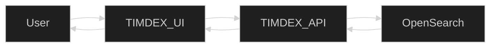
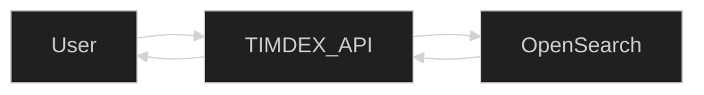
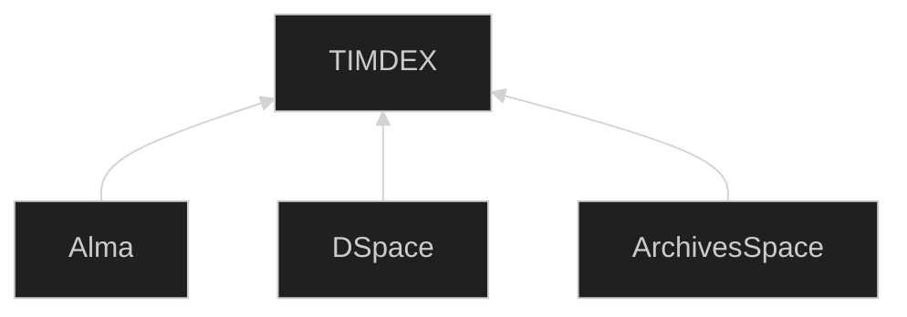
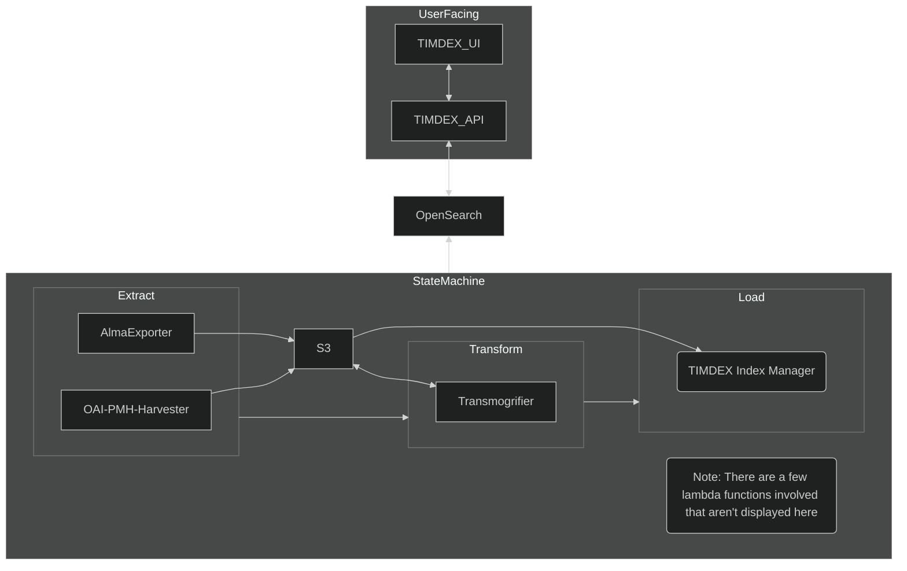

# Technical Overview

The overall system we refer to as TIMDEX aims to provide a way for users to query our local collections to find materials they are interested in.

## Interacting with TIMDEX via UI

A user can query TIMDEX via our User Interface. In this case, the UI application will query the API which will query OpenSearch and they'll pass the information back up the chain to the UI for display.

## Interacting with TIMDEX via API

A core aspect of TIMDEX is that we provide the same API to any user as we use internally. If the user intends to use the data in TIMDEX programatically, it will be much more effective to query the API directly.

## Data sources

No data in TIMDEX originates in TIMDEX. TIMDEX is an index of data from other systems.

Each system stores data in a format native to that system, so TIMDEX includes a normalization process in which we transform data from source native formats to a common TIMDEX format.

The current sources in TIMDEX are Alma, DSpace@MIT, and ArchivesSpace. We also have experimentally added some data from JPAL, Woods Hole, and Zenodo.

## Applications that make up TIMDEX

TIMDEX is not a single application. It's a service that is made up of several applications, some of which are publicly facing (UI and API) and some of which move data around and normalize it.

### Extract

The extract phase is solely responsible for getting data out of other systems. It does not change the data in any way or actually load the data into the system. For all of our sources we extract from, the end result of the extract phase is a file (or set of files) in an S3 bucket.

### Transform

The transform step picks up where extract left off. Transform is handled by our [transmogrifier](https://github.com/MITLibraries/transmogrifier) application.

It reads data in various formats from S3 and outputs a normalized format back to S3. This step is essential as it maps various source formats to a single format that allows for querying and display of metadata from different systems in a way that is consistent and useful to end users.

Note: The name [transmogrifier](https://calvinandhobbes.fandom.com/wiki/Transmogrifier) was taken from the Calvin and Hobbes comic in which Calvin invents a cardboard box that can turn anything into anything else.

### Load

The load step is handled by our [TIMDEX Index Manager](https://github.com/MITLibraries/timdex-index-manager), or TIM. TIM reads the normalized files from S3 and writes them to OpenSearch indexes. TIM handles creating and deleting indexes in addition to loading and deleting data.
